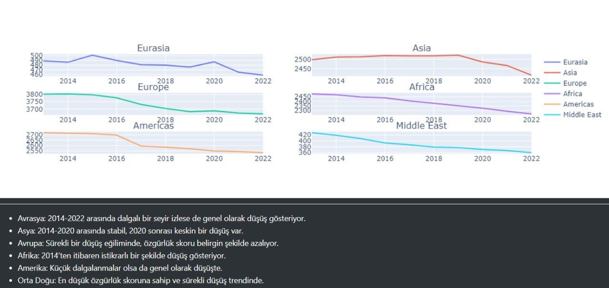
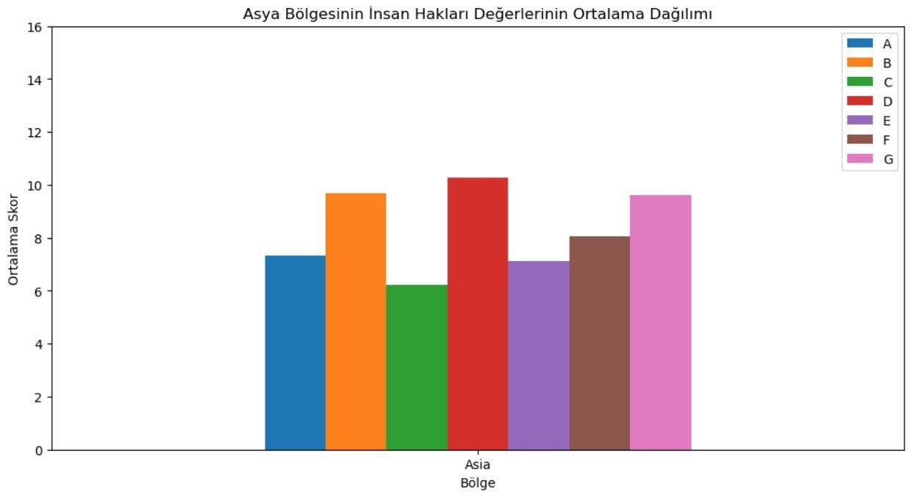
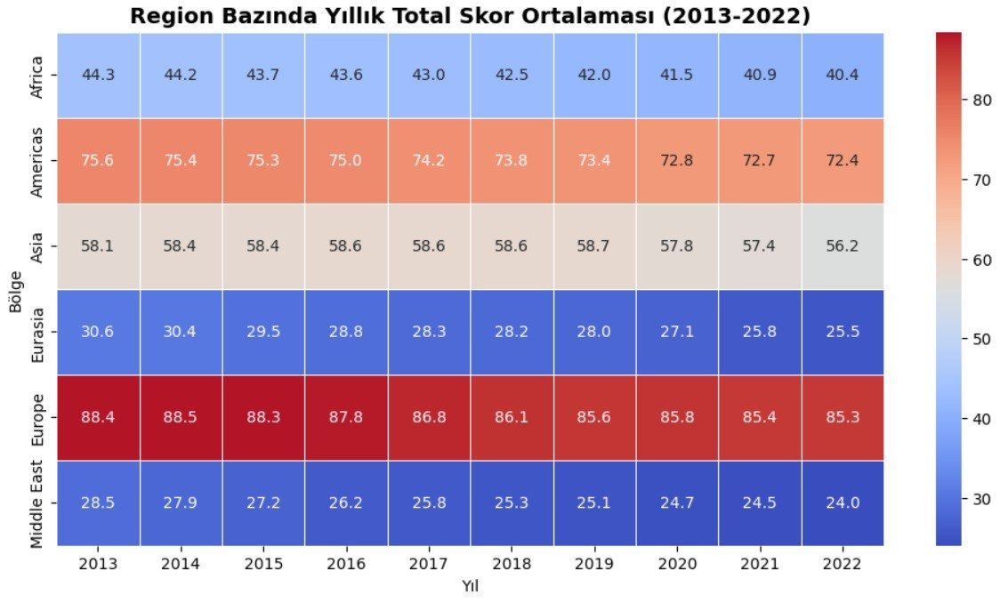
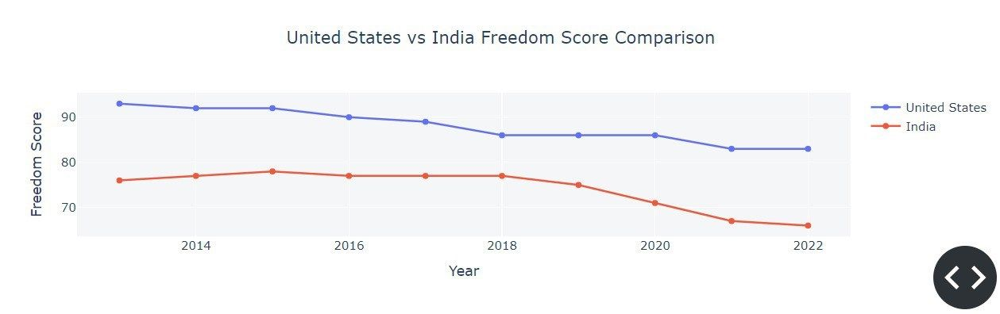
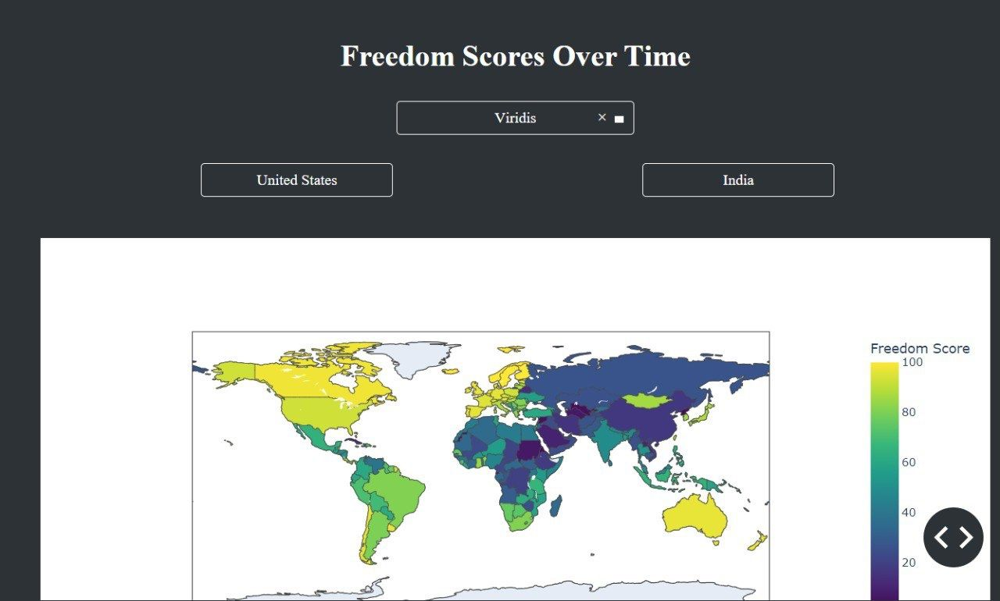
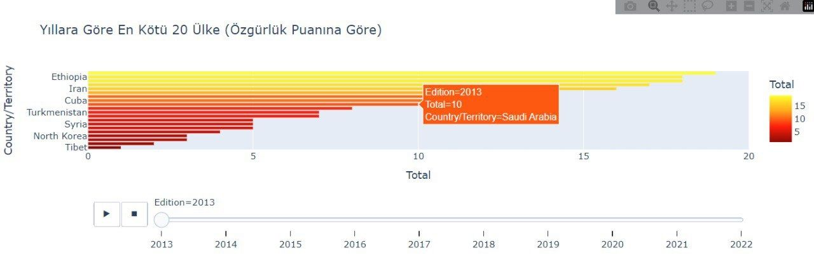
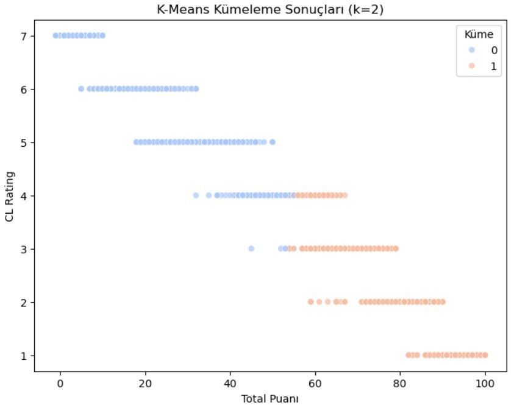

# 📊 Ülkelerin Özgürlük Skorları Analizi (2013-2022) 

## 📌 Proje Amacı
Bu proje, ülkelerin 2013–2022 özgürlük skorlarını analiz etmeyi ve zaman içerisindeki değişimleri görselleştirmeyi amaçlamaktadır.
Ayrıca, makine öğrenmesi (k-means) yöntemi ile ülkeleri özgürlük seviyelerine göre kümeleme yaparak küresel ve bölgesel eğilimleri ortaya koyar.

Özellikler
✔- Yıllara göre özgürlük skorlarının analizi
✔- Dinamik dünya haritası üzerinde görselleştirme
✔- Boxplot & ısı haritası ile ülke karşılaştırmaları
✔- K-means ile kümeleme analizi
✔- En uygun küme sayısının otomatik belirlenmesi (Dirsek Yöntemi & Silüet Analizi)

## 📌 Aşamalar

### 1. Veri Ön İşleme & Keşifsel Veri Analizi (EDA)
-  **Veri setinin incelenmesi**
-  **Eksik ve tekrarlanan verilerin kontrolü**
-  **İstatistiksel analizler**

### 2. Veri Görselleştirme
-  **Zaman içindeki özgürlük skorları değişimi**
-  **Dünya haritasında özgürlük skorları görselleştirmesi**
- **Boxplot ve ısı haritası ile ülke karşılaştırmaları**

### 3. Makine Öğrenmesi - Kümeleme
-  **K-means algoritması** ile özgürlük skorlarına göre gruplama
-  **En uygun küme sayısının belirlenmesi** (Dirsek Yöntemi ve Silüet Analizi)
-  **Kümeleme sonuçlarının görselleştirilmesi**

## 📌 Kullanılan Teknolojiler
-  **Python**, **Pandas**, **NumPy** - Veri işleme ve analiz
-  **Matplotlib**, **Seaborn**, **Plotly** - Veri görselleştirme
-  **Scikit-learn** - Kümeleme algoritmaları
-  **Geopandas**, **Folium** - Coğrafi veri görselleştirme

## 📌 Screenshots  

  
  

  
  

  
  

  
  

